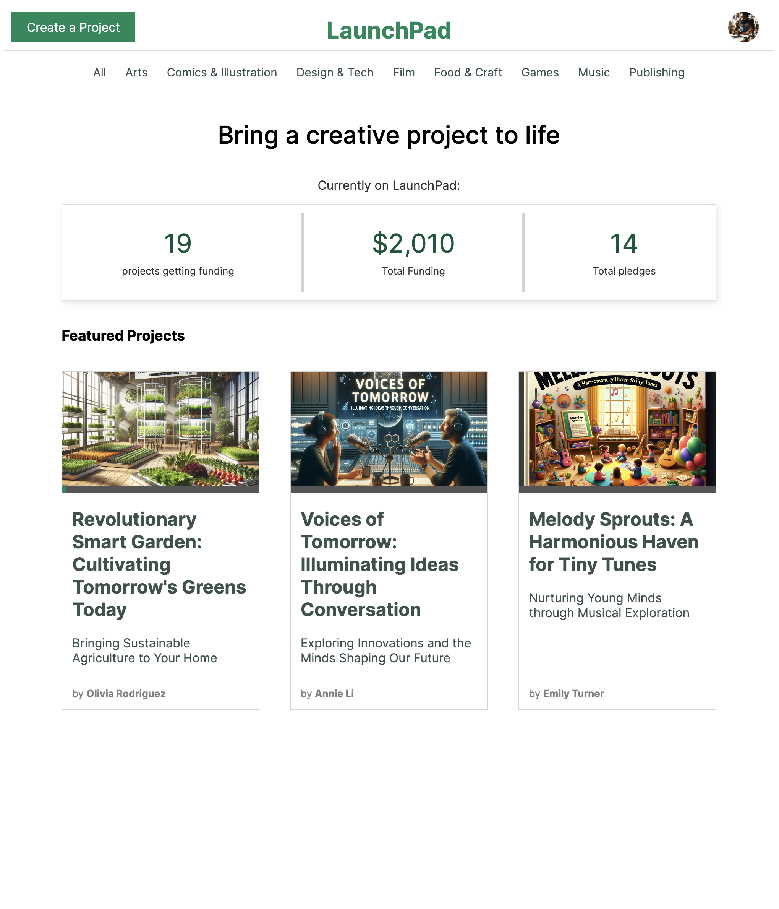
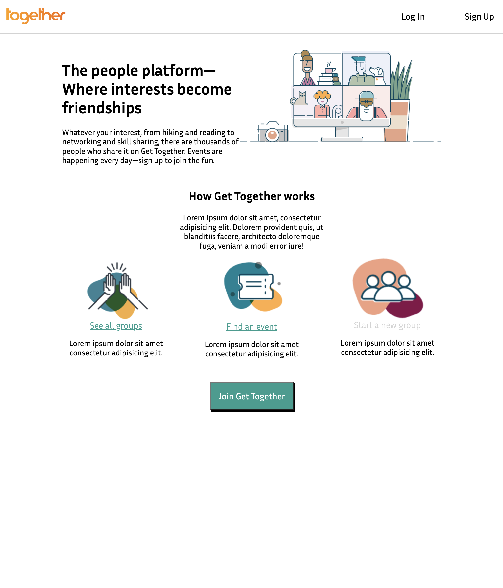

<!--
**thechee/thechee** is a ✨ _special_ ✨ repository because its `README.md` (this file) appears on your GitHub profile.

Here are some ideas to get you started:

-->
## About Me
Before taking the career change plunge into software engineering, I was
a life-long cook and baker. Most recently I founded and operated an award winning bakery in the Bay Area for 5&frac12; years. During that experience I came to realize I wanted something else out of life, and that's when I decided to pursue a career in software engineering.

Years of intense focus and effort in kitchens taught me to learn quickly, adapt to ever-changing variables, and to work well with my team while maintaining a positive work environment. I have a strong, determined work ethic instilled by my parents, and every day I am inspired to do great work by my wife and daughter.

I am always looking for ways to improve my skills and knowledge. My preferred method is building projects, check out some of mine below!

I have a passion for finding the most efficient, effective solutions to problems and I have a deep-seated disdain for bad UI/UX!

When I'm not working, you can find me cooking in the kitchen, enjoying quality time with my family and friends, listening to/playing music (upright bass is my current instrument), trail running, or kayaking around the SF Bay!

## Toolbelt
### Languages

### Frameworks/Tools

## Projects

| Preview | Title |Description | Features | Technologies |
|---------|-------|-------------|----------|--------------|
||Advanture|             |Vans, Ratings/Reviews, Favorites, Filters|              |
||LaunchPad|             |Projects, Rewards, Comments, Backings, Search, Pagination|              |
||Get Together|             |Groups, Events          |             |