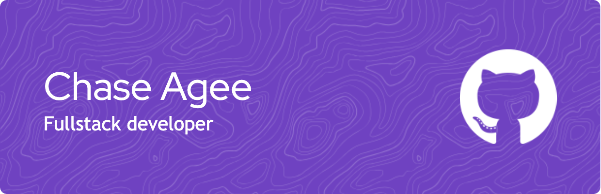

<!--
**thechee/thechee** is a ✨ _special_ ✨ repository because its `README.md` (this file) appears on your GitHub profile.

Here are some ideas to get you started:

-->

## About Me

I spent 5½ years founding and running an award-winning bakery in the Bay Area before pivoting to software. Now ~2 years into working as a software engineer at a startup, shipping production features across the full stack, I've found I care deeply about well-crafted UX.
Outside of work you can find me cooking, spending time with family and friends, listening to/playing music, running, or kayaking the SF Bay.

---

## Toolbelt

### Languages

### Frameworks & Libraries

### Data & Infrastructure

### Tools

